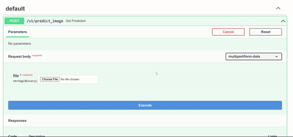

<h1 align="center">Atforestry</h1>

    

> ## Monitoring deforestation using satellite images and computer vision models. 

Tracking deforestation is an essential problem to resolve to fight global warming. This web application monitors satellite images through computer vision models trained to detect critical changes on the earth's surface.

Our MLOps architecture has been set to predict deforestation based upon 2 simple steps: a) classify the type of cover land and (b) compare the cover land at different points in time to detect changes on the surface. 

## Classifying Cover Land

For this task, we are using the [Planet: Understanding the Amazon from Space](https://www.kaggle.com/c/planet-understanding-the-amazon-from-space)  Kaggle competition [dataset](https://www.kaggle.com/competitions/planet-understanding-the-amazon-from-space/data). Additionally, we are leveraging the work done by [EKami](https://github.com/EKami/planet-amazon-deforestation), using a VGG16 convolutional model pre-trained with the Imagenet dataset and retrained to predict the type of cover land on top of the satellite images.

    

<h6 align="center">Planet: Understanding the Amazon from Space</h6>

## Comparing Cover Land

With the trained model and fetching satellite images from the [Planet API](https://developers.planet.com/docs/apis/), Atforestry API compares the type of cover land in 2 different periods. If the initial image had a rainforest type of cover land, such as `primary`,  and the second one has a deforestation tag,  such as `agriculture`, `habitation` or `road`, we can signal  a deforestation case. We are leveraging the work done by [Luis Di Martino](https://github.com/lddm/forests-monitoring) in his article [Monitoring deforestation with open data and Machine Learning](https://medium.com/digital-sense-ai/monitoring-deforestation-with-open-data-and-machine-learning-part-2-c1be298c574b).

    

<h6 align="center">Luis Di Martino - Monitoring deforestation with open data and Machine Learning</h6>

## Data

The Planet dataset consists of images collected from 4-band satellites in sun-synchronous orbit (SSO) and International Space Station (ISS) orbit and was stored using the GeoTiff format. The data was collected between January 1, 2016 and February 1, 2017. All the scenes are from the Amazon basin, which includes Brazil, Peru, Uruguay, Colombia, Venezuela, Guyana, Bolivia, and Ecuador. The type of cover land has already been labeled for us using a mapping csv table. 

To dive into the type of data that we are using, you can check out the [exploration notebook](/notebooks/1_exploration_initial.ipynb). 

## Model

As explained earlier, we are leveraging a pre-trained VGG16 model which consists of 16 convolutional layers with 3x3 convolutions, padding and max-pooling layers of 2x2 filters of stride 2, ending with 2 fully connected layers and a softmax output. The network has almost 138 Million parameters. 

The implementation of the model can be find in the [notebooks](/notebooks/) folder. Please note that this is still a work in progress!

    

<h6 align="center">Architecture of VGG16</h6>

## Preliminary Results

Exploiting FastAPI capabilities, we have set an initial [API](./api/) which runs an inference service to predict cover land types, using a preliminary model trained with just one epoch run:

## To Be Done

During the next 5 weeks, atforestry team will be focused on the below tasks:

- **Training**: Improve the VGG16 model increasing the epochs runs
- **Inference Services**: API to compare the cover land at different points in time
- **Feature Store**: Set up a database to store the data
- **Data Pipelines**: Create pipelines to continuously fetch Planet API data
- **Training Pipelines**: Develop Training Pipelines to retrain model if inferenced tags are not accurate
- **Web Application**: Create a web interface to interact with the APIs
- **Other MLOps Tasks**: Set up Model Registry and Monitoring tools

